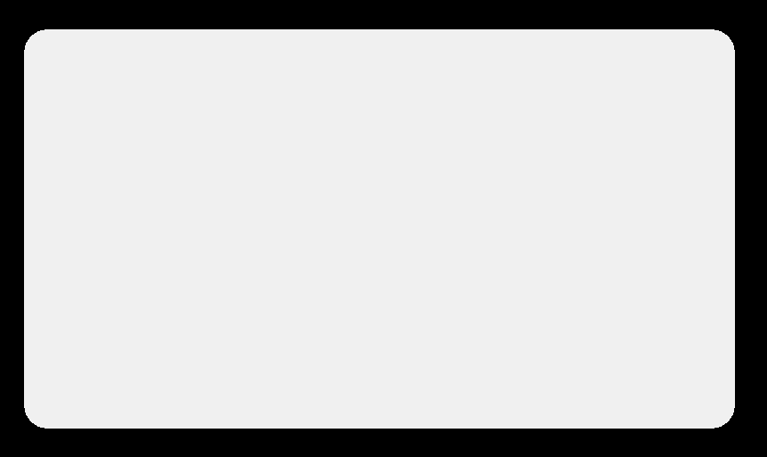
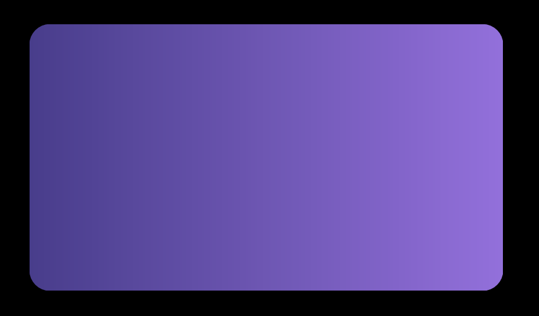

윈폼에서 둥근 테두리에 관하여 검색하면 대부분의 결과가 CreateRoundRectRgn 를 이용한 방법이다.

하지만 CreateRoundRectRgn 를 이용하면 완벽하게 둥근 테두리가 아닌 눈으로 볼때 약간 어색할 수 있는 테두리가 나온다.



이것을 더욱 선명하고 부드럽게 만들어 보자 일단 Win32api 를 이용하지 않고 둥근 사각형을 그려보자.

해당코드는 [여기](https://stackoverflow.com/questions/33853434/how-to-draw-a-rounded-rectangle-in-c-sharp/33853557)를 참조하여 만들었다

2가지 메서드를 추가하고
```csharp
public static GraphicsPath RoundedRect(Rectangle bounds, int radius)
{
    int diameter = radius * 2;
    Size size = new Size(diameter, diameter);
    Rectangle arc = new Rectangle(bounds.Location, size);
    GraphicsPath path = new GraphicsPath();

    if (radius == 0)
    {
        path.AddRectangle(bounds);
        return path;
    }

    // top left arc  
    path.AddArc(arc, 180, 90);

    // top right arc  
    arc.X = bounds.Right - diameter;
    path.AddArc(arc, 270, 90);

    // bottom right arc  
    arc.Y = bounds.Bottom - diameter;
    path.AddArc(arc, 0, 90);

    // bottom left arc 
    arc.X = bounds.Left;
    path.AddArc(arc, 90, 90);

    path.CloseFigure();
    return path;
}

public static void FillRoundedRectangle(Graphics graphics, Brush brush, Rectangle bounds, int cornerRadius)
{
    if (graphics == null)
        throw new ArgumentNullException("graphics");
    if (brush == null)
        throw new ArgumentNullException("brush");

    using (GraphicsPath path = RoundedRect(bounds, cornerRadius))
    {
        graphics.FillPath(brush, path);
    }
}
```

부드러운 효과를 주기 안티 앨리어싱을 사용한다.  
이를 위해 `graphics.SmoothingMode`로 `SmoothingMode.HighQuality` 를 이용한다.  
안티 앨리어싱과 관련한 글은 [여기](https://docs.microsoft.com/en-us/dotnet/framework/winforms/advanced/antialiasing-with-lines-and-curves)서 볼수 있다.

```csharp
private void Form1_Paint(object sender, PaintEventArgs e)
{
    Graphics graphics = e.Graphics;

    Rectangle gradientRectangle = new Rectangle(0, 0, this.Width - 1, this.Height - 1);

    Brush b = new LinearGradientBrush(gradientRectangle, Color.DarkSlateBlue, Color.MediumPurple, 0.0f);

    graphics.SmoothingMode = SmoothingMode.HighQuality;
    FillRoundedRectangle(graphics, b, gradientRectangle, 35);
}
```
여기까지 끝나면 위의 방식보다 둥근 사각형을 얻을 수 있다.


그러면 이제 꼭짓점 부분을 투명하게 만들어 보자.

해당 코드는 [여기](https://www.codeproject.com/Articles/1822/Per-Pixel-Alpha-Blend-in-C)를 참고하여 만들었다.

우리는 꼭짓점 부분을 투명하게 만들기 위하여 Per Pixel Alpha Blend를 이용할 것 이다.

```csharp
public void SetBitmap(Bitmap bitmap)
{
    SetBitmap(bitmap, 255);
}

public void SetBitmap(Bitmap bitmap, byte opacity)
{
    if (bitmap.PixelFormat != PixelFormat.Format32bppArgb)
        throw new ApplicationException("The bitmap must be 32ppp with alpha-channel.");


    IntPtr screenDc = Win32.GetDC(IntPtr.Zero);
    IntPtr memDc = Win32.CreateCompatibleDC(screenDc);
    IntPtr hBitmap = IntPtr.Zero;
    IntPtr oldBitmap = IntPtr.Zero;

    try
    {
        hBitmap = bitmap.GetHbitmap(Color.FromArgb(0));
        oldBitmap = Win32.SelectObject(memDc, hBitmap);

        Win32.Size size = new Win32.Size(bitmap.Width, bitmap.Height);
        Win32.Point pointSource = new Win32.Point(0, 0);
        Win32.Point topPos = new Win32.Point(Left, Top);
        Win32.BLENDFUNCTION blend = new Win32.BLENDFUNCTION();
        blend.BlendOp = Win32.AC_SRC_OVER;
        blend.BlendFlags = 0;
        blend.SourceConstantAlpha = opacity;
        blend.AlphaFormat = Win32.AC_SRC_ALPHA;

        Win32.UpdateLayeredWindow(Handle, screenDc, ref topPos, ref size, memDc, ref pointSource, 0, ref blend, Win32.ULW_ALPHA);
    }
    finally
    {
        Win32.ReleaseDC(IntPtr.Zero, screenDc);
        if (hBitmap != IntPtr.Zero)
        {
            Win32.SelectObject(memDc, oldBitmap);
            Win32.DeleteObject(hBitmap);
        }

        Win32.DeleteDC(memDc);
    }
}

protected override CreateParams CreateParams
{
    get
    {
        CreateParams cp = base.CreateParams;
        cp.ExStyle |= 0x00080000;
        return cp;
    }
}
```

위에 있는 메서드를 추가하고 `Form Load` 부분에 해당 코드를 추가한다.

```csharp
private void Form1_Load(object sender, EventArgs e)
{
    Bitmap myBitmap = new Bitmap(this.Width, this.Height);

    Graphics graphics = Graphics.FromImage(myBitmap);

    Rectangle gradientRectangle = new Rectangle(0, 0, this.Width - 1, this.Height - 1);

    Brush b = new LinearGradientBrush(gradientRectangle, Color.DarkSlateBlue, Color.MediumPurple, 0.0f);

    graphics.SmoothingMode = SmoothingMode.HighQuality;
    FillRoundedRectangle(graphics, b, gradientRectangle, 35);

    SetBitmap(myBitmap);
}
```

해당코드는 폼 사이즈와 동일한 Bitmap을 만들고 그 위에 둥근 사각형을 그리는 것 이다.




이로써 둥근 사각형의 완성이다.

만들어진 폼의 전체 코드이다
```csharp
public partial class Form1 : Form
{
    public Form1()
    {
        InitializeComponent();
        FormBorderStyle = FormBorderStyle.None;
    }

    private void Form1_Load(object sender, EventArgs e)
    {
        if (!DesignMode)
        {
            Bitmap myBitmap = new Bitmap(this.Width, this.Height);

            Graphics graphics = Graphics.FromImage(myBitmap);

            Rectangle gradientRectangle = new Rectangle(0, 0, this.Width - 1, this.Height - 1);

            Brush b = new LinearGradientBrush(gradientRectangle, Color.DarkSlateBlue, Color.MediumPurple, 0.0f);

            graphics.SmoothingMode = SmoothingMode.HighQuality;
            FillRoundedRectangle(graphics, b, gradientRectangle, 35);

            SetBitmap(myBitmap);
        }
    }

    public static GraphicsPath RoundedRect(Rectangle bounds, int radius)
    {
        int diameter = radius * 2;
        Size size = new Size(diameter, diameter);
        Rectangle arc = new Rectangle(bounds.Location, size);
        GraphicsPath path = new GraphicsPath();

        if (radius == 0)
        {
            path.AddRectangle(bounds);
            return path;
        }

        // top left arc  
        path.AddArc(arc, 180, 90);

        // top right arc  
        arc.X = bounds.Right - diameter;
        path.AddArc(arc, 270, 90);

        // bottom right arc  
        arc.Y = bounds.Bottom - diameter;
        path.AddArc(arc, 0, 90);

        // bottom left arc 
        arc.X = bounds.Left;
        path.AddArc(arc, 90, 90);

        path.CloseFigure();
        return path;
    }

    public static void DrawRoundedRectangle(Graphics graphics, Pen pen, Rectangle bounds, int cornerRadius)
    {
        if (graphics == null)
            throw new ArgumentNullException("graphics");
        if (pen == null)
            throw new ArgumentNullException("pen");

        using (GraphicsPath path = RoundedRect(bounds, cornerRadius))
        {
            graphics.DrawPath(pen, path);
        }
    }

    public static void FillRoundedRectangle(Graphics graphics, Brush brush, Rectangle bounds, int cornerRadius)
    {
        if (graphics == null)
            throw new ArgumentNullException("graphics");
        if (brush == null)
            throw new ArgumentNullException("brush");

        using (GraphicsPath path = RoundedRect(bounds, cornerRadius))
        {
            graphics.FillPath(brush, path);
        }
    }

    public void SetBitmap(Bitmap bitmap)
    {
        SetBitmap(bitmap, 255);
    }

    public void SetBitmap(Bitmap bitmap, byte opacity)
    {
        if (bitmap.PixelFormat != PixelFormat.Format32bppArgb)
            throw new ApplicationException("The bitmap must be 32ppp with alpha-channel.");


        IntPtr screenDc = Win32.GetDC(IntPtr.Zero);
        IntPtr memDc = Win32.CreateCompatibleDC(screenDc);
        IntPtr hBitmap = IntPtr.Zero;
        IntPtr oldBitmap = IntPtr.Zero;

        try
        {
            hBitmap = bitmap.GetHbitmap(Color.FromArgb(0));
            oldBitmap = Win32.SelectObject(memDc, hBitmap);

            Win32.Size size = new Win32.Size(bitmap.Width, bitmap.Height);
            Win32.Point pointSource = new Win32.Point(0, 0);
            Win32.Point topPos = new Win32.Point(Left, Top);
            Win32.BLENDFUNCTION blend = new Win32.BLENDFUNCTION();
            blend.BlendOp = Win32.AC_SRC_OVER;
            blend.BlendFlags = 0;
            blend.SourceConstantAlpha = opacity;
            blend.AlphaFormat = Win32.AC_SRC_ALPHA;

            Win32.UpdateLayeredWindow(Handle, screenDc, ref topPos, ref size, memDc, ref pointSource, 0, ref blend, Win32.ULW_ALPHA);
        }
        finally
        {
            Win32.ReleaseDC(IntPtr.Zero, screenDc);
            if (hBitmap != IntPtr.Zero)
            {
                Win32.SelectObject(memDc, oldBitmap);
                Win32.DeleteObject(hBitmap);
            }

            Win32.DeleteDC(memDc);
        }
    }

    protected override CreateParams CreateParams
    {
        get
        {
            CreateParams cp = base.CreateParams;
            if (!DesignMode)
            {
                cp.ExStyle |= 0x00080000;
            }
            return cp;
        }
    }

    private void Form1_Paint(object sender, PaintEventArgs e)
    {
        if (DesignMode)
        {
            Graphics graphics = e.Graphics;

            Rectangle gradientRectangle = new Rectangle(0, 0, this.Width - 1, this.Height - 1);

            Brush b = new LinearGradientBrush(gradientRectangle, Color.DarkSlateBlue, Color.MediumPurple, 0.0f);

            //graphics.SmoothingMode = SmoothingMode.HighQuality;
            FillRoundedRectangle(graphics, b, gradientRectangle, 35);
        }
    }
}
```

해당 작업에 사용한 win32api 코드이다.
```csharp
class Win32
{
    public enum Bool
    {
        False = 0,
        True
    };


    [StructLayout(LayoutKind.Sequential)]
    public struct Point
    {
        public Int32 x;
        public Int32 y;

        public Point(Int32 x, Int32 y) { this.x = x; this.y = y; }
    }


    [StructLayout(LayoutKind.Sequential)]
    public struct Size
    {
        public Int32 cx;
        public Int32 cy;

        public Size(Int32 cx, Int32 cy) { this.cx = cx; this.cy = cy; }
    }


    [StructLayout(LayoutKind.Sequential, Pack = 1)]
    struct ARGB
    {
        public byte Blue;
        public byte Green;
        public byte Red;
        public byte Alpha;
    }


    [StructLayout(LayoutKind.Sequential, Pack = 1)]
    public struct BLENDFUNCTION
    {
        public byte BlendOp;
        public byte BlendFlags;
        public byte SourceConstantAlpha;
        public byte AlphaFormat;
    }


    public const Int32 ULW_COLORKEY = 0x00000001;
    public const Int32 ULW_ALPHA = 0x00000002;
    public const Int32 ULW_OPAQUE = 0x00000004;

    public const byte AC_SRC_OVER = 0x00;
    public const byte AC_SRC_ALPHA = 0x01;


    [DllImport("user32.dll", ExactSpelling = true, SetLastError = true)]
    public static extern Bool UpdateLayeredWindow(IntPtr hwnd, IntPtr hdcDst, ref Point pptDst, ref Size psize, IntPtr hdcSrc, ref Point pprSrc, Int32 crKey, ref BLENDFUNCTION pblend, Int32 dwFlags);

    [DllImport("user32.dll", ExactSpelling = true, SetLastError = true)]
    public static extern IntPtr GetDC(IntPtr hWnd);

    [DllImport("user32.dll", ExactSpelling = true)]
    public static extern int ReleaseDC(IntPtr hWnd, IntPtr hDC);

    [DllImport("gdi32.dll", ExactSpelling = true, SetLastError = true)]
    public static extern IntPtr CreateCompatibleDC(IntPtr hDC);

    [DllImport("gdi32.dll", ExactSpelling = true, SetLastError = true)]
    public static extern Bool DeleteDC(IntPtr hdc);

    [DllImport("gdi32.dll", ExactSpelling = true)]
    public static extern IntPtr SelectObject(IntPtr hDC, IntPtr hObject);

    [DllImport("gdi32.dll", ExactSpelling = true, SetLastError = true)]
    public static extern Bool DeleteObject(IntPtr hObject);
}
```